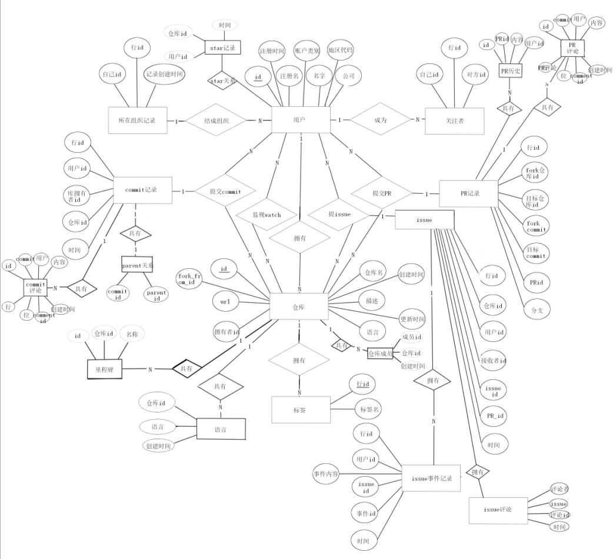

# github数据库设计

## 需求描述

需求概括：利用网络爬虫技术抓取 github.org数据，设计相应的本地数据库

需求细节：

1. 需要实现仓库信息的存储，包括仓库地址，所有者/组织，语言，参与贡献的成员，贡献（commit），issue，pull_request;
2. 需要实现用户信息的存储，包括用户名称，邮箱，创建的仓库，参与的组织，收藏的仓库(star_at),监视的仓库(watch),地区，注册时间等；
3. 需要实现存储过程供后台查询数据时调用，包括：
   1. 查询一天、一星期、一个月内新增的仓库数；
   2. 查询用户仓库，按获得的star降序排序；
   3. 查询特定语言的仓库获得，按获得的star降序排序；
   4. 查询本日/周/月新增仓库与上一日/周/月新增仓库的变化值；
   5. 查询用户，按照获得star的数量降序排序
4. 需要实现前端用网页展示出3中的数据
5. 需要实现爬虫，爬取github上的数据。

## 整体组成部分分析

假设该网络爬虫爬取github.org数据，首先考虑有哪些数据可以爬取：

- 用户信息，虽然作为普通用户，我们不能爬取其他用户的信息，但是有时开发人员与研究人员需要用户信息作为数据；
- 仓库信息，仓库信息可以再用户主页获取，也可以在搜索页面获取，但是无论通过什么渠道获取，都是同样的schema
- 仓库内容与文件版本迭代，通过后面的讨论，我们得出了这一部分的实现方法——用树把不同版本的仓库结合在一起，这一做法的具体实现是给每一个版本的仓库添加 parent 属性指向它的上一个版本，根节点则指向它本身
- 爬虫模块设计，由于 github 是一个非常开放的网站，他提供了 api 让互联网用户通过 api 方便地爬取数据，因此我们使用爬虫多次调用 api 来爬取数据。

## 细节考虑与分析

### 仓库信息

考虑一个仓库中包含的数据：

- 代码  Text
- 仓库所有者，可以以外键的形式
- 仓库贡献者，可以使用外键
- 语言  varchar
- 分支 int
- 标签  varchar

### 仓库内容

#### 仓库文件版本迭代与分支管理的解决方案

这是一个困难的问题，我们在进行了一些思考后，为了防止我们自身的思考过于局限，我们在网上搜索了非常切合github本身实现办法的方法

##### 我们的想法

- 仓库的每一个版本都独立存储为一个实体
- 只存储仓库的第一个版本，随后每次有更新就只存储更新的内容

##### 在Quora中得到的优化解

> 原回答：https://www.quora.com/In-what-way-is-Githubs-database-structured-so-that-users-can-always-get-previous-versions-of-their-code-Whats-the-schema

对于该回答的总结：

- 每一个commit的版本有一个哈希值
- commit记录了这个版本中所有object，其中：
  - 如果这个版本中的object与之前的版本不同，则它具有一个新的object并且它是一个新的object
  - 另外一类object，它们没有被修改，那么它们的哈希值和实体都还是原来的
  - 每个commit有一个parent，用于找到那个没被修改的object，或者进行被修改object的恢复

实现：

commit 以仓库的 id 为外键， commit 设置 parent 属性指向它的上一个版本。

#### 仓库fork from信息爬取

在爬取仓库时，会发现有的仓库fork from其他仓库，按照正常的建库逻辑，fork from（在表中是int属性，仓库的id）的源头必须存在；但是在爬取仓库信息时，可能会遇到fork from的仓库还没有被爬取到的情况，会因此而违反外键约束，对此有以下解决办法可参考：

- 捕获 Exception，跳过当前行的插入
- 捕获 Exception，插入当前行并把 fork from 置为 null 
- 捕获 Exception，插入当前行，并使用触发器在 project 表中插入 fork from，后续爬取数据时如果爬到这个 fork from 的仓库则不执行 insert 操作而执行 alter 操作

关键代码：

```
sql = '
BEGIN
INSERT INTO project VALUES ({},'{}', {},'{}','{}','{}','{}', {},  {},  '{}'  )
EXCEPTION
    -- 违反外键存在约束
    WHEN 23503 THEN BEGIN
        INSERT INTO project VALUES({},null,null,null,null,null,null,null,null,null);
        INSERT INTO project VALUES ({},'{}', {},'{}','{}','{}','{}', {},  {},  '{}'  );
        END;
    -- 违反主键 id 唯一 约束
    WHEN 23505 THEN BEGIN
    	ALTER TABLE project
    	set url = '{}', owner = {}, id = {}, name = '{}',des = '{}',language = '{}', created_at = '{}',fork_from = {}，deleted= {}， updated_at= {}
        where id = {};
    END;
END;
'
.format(repo["id"],repo["url"],repo["owner"]["id"],repo["name"],des,repo["language"],repo["created_at"],repo["fork_from"],'null',repo["updated_at"],

repo["fork_from"],

repo["id"],repo["url"],repo["owner"]["id"],repo["name"],des,repo["language"],repo["created_at"],repo["fork_from"],'null',repo["updated_at"],

repo["url"],repo["owner"]["id"],repo["name"],des,repo["language"],repo["created_at"],repo["fork_from"],'null',repo["updated_at"],

repo["id"]
);
```


reference: [Documentation: 9.4: PostgreSQL Error Codes](https://www.postgresql.org/docs/9.4/errcodes-appendix.html)

我们逐步地想出了这三种方案，但在尝试了第三种方案后，我们退回来选择了第二种方案，原因是第三种方案在异常处理中仍然可能遇到for from的仓库没有爬取下来的问题，这样就会嵌套/递归地进行异常处理，非常复杂，因此我们“回滚”到了第二种方法。

### 用户设计分析


- 注意到用户是通过邮箱登录的，因此考虑过把邮箱作为主键，但是进一步想到主键会被频繁的用于比较，所以这样的做法其实并不合适，应该给用户分配一个 int 作为id

遇到的问题：

- star有一个数量，同时有一个列表，following和follower也一样，可以只针对用户定义相应的变量，例如：只记录每一个用户收藏了那些仓库，在需要某一个仓库的收藏量的数据时，从所有的数据中搜索收藏了该仓库的用户。（此处本来认为需要用空间换取时间的，但是参考了下面好友列表的设计例子后，发现从好友关系表中查找（计算）出好友列表这样庞大的计算量都不需要以空间换取时间，所以此处具有更小的查找量也不需要用空间换取时间）
- 继续上面的问题：列表和数量，列表可以计算出数量，因此在有列表的情况下数量其实是冗余的
- 继续上面的问题：一个用户可以有多个列表，这样似乎会发生表的嵌套，不符合最基本的1NF，上网搜索到了类似情况的解决方案，类似于好友列表。

新建一个表用于存储同一个表的行之间的关系（例如关注与被关注的关系），记录了关系了出发点（如关注者），关系的结束点（如被关注者）。

后续的许多关系也使用了这样的形式，例如，仓库具有的语言，仓库具有的issue，issue具有的评论，等等。

​    从爬虫的角度思考好友列表的问题，爬虫从github爬下来的一定是一个列表，但是github后台真正存储好友的可能是一个混杂的关系表。

## Schema 设计

schema 表（见 schema.pdf）

评论的设计：

- 在issue，commit，pull_request都用到了评论，对此我们讨论出两种可选的方法：
  - 1. 三个场景都是用相同的评论schema，好处是不用建更多的表，坏处是查询代价会提高（一开始的设计）
    2. 三个场景分别建表，好处是查询代价可以降低（经过小组成员审核后提出的方案）
  - 我们选择了第二种方案，只需要再建表时多做几步，就可以持久地提高数据库的效率。

#### 主要的表

一些大的实体所具有的属性在现实中具有嵌套的性质，但是根据第一范式不能进行表的嵌套，因此大的实体具有一些小的表维护这些小的属性与大的实体的依附关系。

- 仓库表
  - commit表
    - commit评论表
  - issue表
    - issue评论表
    - 
  - pull_request表
    - pr历史表
    - pr评论表
- 用户表
  - 组织表
  - 关注关系表

#### 约束

- 主键：为了保证后期新建的表需要reference时都能满足，需要对每一个表设置id作为主键
- 外键：ER图中呈现了外键依赖关系

#### 触发器

- 

#### 存储过程

- 插入爬取的用户信息，并进行异常捕捉跳过重复的记录（见CrawData.py 105行）
- 插入爬取的仓库信息，并进行异常捕捉处理fork from不存在的外键不存在异常（set null），处理重复仓库异常（refuse and continue）（Craw.py 139行）
- 爬取star信息

- 搜索一天内的仓库数量按 star 降序排序
- 查询created at 为一天内，一个月内，一年内的仓库，返回数量

ER图




## 爬虫设计

使用 scrapy 实现爬虫
使用 yaml 保存爬虫运行时将用到的信息，如密码，需要执行的 sql 等

## 前端设计

一个仓库展示页，展示一天内，一周内，一个月内的火热仓库

展示的火热仓库可以按照地区，语言，标签等进行分区

以上功能本质上是sql在发挥作用

需要前端提供适配（当然也可以直接在pgAdmin中进行）

原理：爬取github仓库到数据库后展示到前端，使用sql筛选要展示的数据

### 7日内新增仓库数量变化

### 本月新增仓库的数量

与上一月的变化

### 本季度新增仓库数量

与上一季度相比的变化

### 每日收获star数量用户排行榜

### 每日收获star数量仓库排行榜

### 每日star数量所用语言排行榜

### 本月收获star最多的仓库

## sql设计

- 查询语句

## 爬取方案

- 我们认为如果要把github数据爬到数据库的话，需要按照users进行爬取，爬取了user之后就已经获得了大量、全面的有用信息（因为user id）是其他 table 的外键，然后方便我们快速进入数据查询和展示阶段；
- 没有无主的仓库，但是会有不建仓库的用户，因此爬取用户显然比爬取仓库更为合理有效；

## 后端增强设计

在对github背后的数据库进行了逆向分析之后，我们在知乎和github上了解到了一些github使用的提高数据库效率的办法（是一些开源项目）：

- bcrypt-ruby：bcrypt- Ruby是OpenBSD bcrypt()密码散列算法的Ruby绑定，允许您轻松存储用户密码的安全散列。
- ZeroClipboard：ZeroClipboard库提供了一种使用不可见的Adobe Flash影片和JavaScript接口将文本复制到剪贴板的简单方法。
- Resque：企业所使用的!Resque是一个redisr支持的Ruby库，用于控制后台作业。

## 编码与单元测试

### sql 编码与单元测试

- 根据 schema 进行表的建立，其中包含了约束的建立
- 编写常用的 sql 查询语句，存储在同一个 sql 文件中
- 单元测试：依次运行建表语句和查询语句，确保它们能够编译通过和执行正确

### 爬虫的编码与单元测试

- 连接数据库；单元测试：运行文件测试能否插入一行 user 信息； 运行结果： 成功； 运行报告：需要明确 postgre server 运行的端口号是 5432， 与pgAdmin的要区分。
- 遍历具有一定规律的自动生成的关键词列表进行搜索信息； 单元测试：运行程序输出获取到的搜索结果，查看是否有意义。
- 下载搜索到的信息，用 item 存储； 单元测试：运行程序后输出下载到的信息，查看是否正确。
- 将存储的信息用 sql 存放到数据库； 单元测试： 运行程序后查看 postgre database 中是否能查到插入的数据。

|  功能    |   单元测试方案   |   测试结果   |   测试报告   |
| ---- | ---- | ---- | ---- |
| 连接数据库 | 运行文件测试能否插入一行 user 信息 | 成功|需要明确 postgre server 运行的端口号默认情况下是固定的5432， 与pgAdmin的1062要区分。 |
| 遍历具有一定规律的自动生成的<br>关键词列表进行搜索信息 |行程序输出获取到的搜索结果，查看是否有意义。 | |
| 下载搜索到的信息<br>用 item 存储 | 运行程序后输出下载到的信息，查看是否正确。| |
| 将存储的信息用<br> sql 存放到数据库 | 运行程序后查看 postgre database 中是否能查到插入的数据。| |


## 参考：

https://ghtorrent.org/relational.html(github schema)

https://www.quora.com/What-is-GitHubs-database-schema(github高效运转)

https://zhuanlan.zhihu.com/p/165940906（sql编写规范）